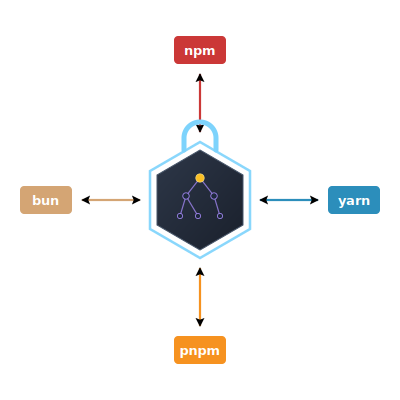

# @antongolub/lockfile

> Universal lockfile model and converter for **npm**, **yarn**, **pnpm**, **bun**.

<p>

Each package manager brings its own philosophy of how to describe, store and
control project dependencies. Inside a single repo it's invisible to the
developer — but it becomes a recurring cost for InfoSec, DevOps and release
engineers, and makes consistent policy unenforceable across the enterprise.

This library models the dependency graph independent of any specific
package manager, then projects it back into the format you need.
Conversion is one use case; modification (audit-fix, override pinning,
license filtering) is the headline.

</p>

## Status

**Snapshot preview.** Every format below parses and stringifies; conversion is
*semantically equivalent*, not byte-identical (see [Concept](#concept)).
Published as `0.0.0-snapshot.*` builds — the first stable release is pending.
[SCHEMAS.md](./SCHEMAS.md) maps each format id to the package-manager versions
that emit it.

> **ℹ️ Active R&D — snapshot channel.** While the project is under active research &
> development, every release ships to the **snapshot channel** (`0.0.0-snapshot.N`,
> published under the `snapshot` npm dist-tag) rather than `latest`. Install the newest
> snapshot with `npm i @antongolub/lockfile@snapshot`, or pin an exact build
> (e.g. `npm i @antongolub/lockfile@0.0.0-snapshot.61`). The first stable `latest`
> release is pending.

| Format | `detect` | `parse` | `stringify` |
|--------|:-:|:-:|:-:|
| `npm-1` · `npm-2` · `npm-3`        | ✓ | ✓ | ✓ |
| `yarn-classic`                    | ✓ | ✓ | ✓ |
| `yarn-berry-v4` … `yarn-berry-v10`| ✓ | ✓ | ✓ |
| `pnpm-v5` · `pnpm-v6` · `pnpm-v9`  | ✓ | ✓ | ✓ |
| `bun-text`                        | ✓ | ✓ | ✓ |

Graph-level operations apply to **any** parsed graph, regardless of source
format: `convert` (parse any → stringify any), `modify` (audit-fix,
override-pin, license-filter), and `optimize` (orphan GC / dedup).

## Concept

A target lockfile is **constructed** from facts gathered across whatever
sources are available: the input lockfile bytes, project `package.json`s,
the package-manager cache, and (opt-in) the registry. The simplest case is
*conversion* — parse one format, stringify another. The general case is
*construction*: assemble what the target requires from whichever source can
supply it.

Three layers, never collapsed:

- **Manifest** — declared constraints from `package.json`(s).
- **Graph** — resolved package instances (peer-aware) and the edges
  between them. The canonical internal model. Modifiers operate here.
- **Layout** — physical projection on disk: hoisted, isolated (pnpm-style),
  PnP, nm-linked.

Conversion is **lossy by design**. We aim for *semantically equivalent*,
not *byte-identical*. Irreducible facts (integrity hashes, resolution URLs,
signatures) are the exception — they are never silently lost.

## API

```ts
import { parse, stringify, convert } from '@antongolub/lockfile'

// explicit format (it's always the first argument):
const graph = parse('pnpm-v9', raw)
const out   = stringify('npm-3', graph)

// or one step, auto-detecting the source:
const npm = convert(raw, { to: 'npm-3' })
```

The format is **explicit**, never implicit — `parse` and `stringify` both take
it as the first argument; `detect` sniffs it from the bytes when you don't know
it. Round-tripping is a choice the caller makes, not a default.

```ts
detect(input: string): FormatId | undefined
check(format: FormatId, input: string): boolean
parse(format: FormatId, input: string, opts?: ParseOptions): Graph
stringify(format: FormatId, graph: Graph, opts?: StringifyOptions): string
convert(input: string, opts: ConvertOptions): string   // parse(from) → stringify(to)
```

`Graph` is the canonical, package-manager-independent model; `FormatId` is a
string-literal union (the [Status](#status) table lists every id, and
[SCHEMAS.md](./SCHEMAS.md) maps each to the package-manager versions behind it).

### Operating on the graph

The graph is where the value lives — `modify` and `optimize` transform it,
format-agnostically:

- **`modify`** applies a `Primitive[]` — `replaceVersion`, `pinOverride`,
  `addDependency`, `removeDependency`, `applyPatch`, `filterLicense` — the
  building blocks of audit-fix, override-pinning and license filtering.
- **`optimize`** runs orphan GC / dedup over the graph (a production-reachability
  sweep). **`pruneOrphans`** (via `@antongolub/lockfile/optimize`) is the
  reference-count sibling: it retires only nodes that lost their *last* incoming
  edge of any kind — post-bump cleanup that, unlike reachability, never
  over-collects a still-referenced dev/optional/peer dep.
- **`overridesOf(graph)`** reads the canonical overrides back out.

### Options

```ts
type ParseOptions = {
  workspaceRoot?: string                     // FS root for out-of-lockfile reads (patch bytes, manifests)
  manifests?:     Record<string, Manifest>   // package.jsons keyed by workspace path
  onDiagnostic?:  (d: Diagnostic) => void
}

type StringifyOptions = {
  lineEnding?:   'lf' | 'crlf'
  cacheKey?:     string                       // yarn-berry cache-key prefix
  overrides?:    OverrideConstraint[]         // canonical overrides → native projection
  onDiagnostic?: (d: Diagnostic) => void
}
```

`manifests` supplies the workspace/override context the lockfile bytes cannot
carry on their own (notably for `yarn-classic` monorepos); everything else
succeeds offline against the bytes alone. Registry- and cache-backed refinement
ships as opt-in adapters (see [Sub-imports](#sub-imports)).

### Sub-imports

| Surface | Importable as | Contains |
|---------|---------------|----------|
| Root | `@antongolub/lockfile` | `detect`, `check`, `parse`, `stringify`, `convert`, `modify`, `optimize`, `overridesOf`, plus types `Graph`, `FormatId`, `ParseOptions`, `StringifyOptions`, `ConvertOptions`, `Manifest` |
| Modifiers | `@antongolub/lockfile/modify` | the individual `Primitive` functions behind `modify` (audit-fix, override-pin, license-filter) |
| Complete | `@antongolub/lockfile/complete` | `completeTransitives` — registry-backed tree completion that wires the transitive deps a modify introduced |
| Optimize | `@antongolub/lockfile/optimize` | `optimize` (reachability orphan GC) and `pruneOrphans` (reference-count orphan GC) |
| Enrich | `@antongolub/lockfile/enrich` | `refurbish` — monotone field-fill (e.g. recomputes a yarn-berry zip `checksum` from a tarball source so a patched lock installs without `yarn install`) |
| Registry | `@antongolub/lockfile/registry` | `frozenRegistry`, `liveRegistry`, `fsCache`, `npmCache`, `pnpmCache` |
| Per-format | `@antongolub/lockfile/formats/<id>` | a single adapter directly (test surface; not a primary user API) |

### Errors

`parse` / `stringify` throw a single `LockfileError` discriminated by
`code`:

```ts
'PARSE_FAILED' | 'FORMAT_DETECT_FAILED' | 'FORMAT_MISMATCH'
| 'CAPABILITY_LACK' | 'MISSING_MANIFEST' | 'MISSING_REQUIRED_FIELD'
| 'INVALID_INPUT' | 'ENRICH_REQUIRED' | 'IRREDUCIBLE_LOSS'
| 'PIPELINE_DIVERGED' | 'REGISTRY_UNREACHABLE' | 'INVARIANT_VIOLATION'
```

Reducible losses (e.g. dropped patches when emitting `npm-1` from a
yarn-berry source) surface as `Diagnostic` events via the
`onDiagnostic` callback, not exceptions.

## Schemas

Every recognised lockfile schema is enumerated in
[SCHEMAS.md](./SCHEMAS.md), with adapter ids, the schema-marker each
carries, the package-manager versions that emit it by default, and
permalinked sources. Use that table as the index when calling
`parse({ format })` or `stringify({ format })`.

## Predecessor and inspirations

This project is the architectural successor to
[`yarn-audit-fix`](https://github.com/antongolub/yarn-audit-fix), generalised
beyond yarn.

Earlier work in this space:

- [synp](https://github.com/imsnif/synp)
- [snyk-nodejs-lockfile-parser](https://github.com/snyk/nodejs-lockfile-parser)
- [`@yarnpkg/lockfile`](https://github.com/yarnpkg/yarn/tree/master/packages/lockfile)
- [`pnpm/lockfile-utils`](https://github.com/pnpm/pnpm/tree/main/lockfile)

## Package-manager docs

- [`package-lock.json`](https://docs.npmjs.com/cli/v10/configuring-npm/package-lock-json)
  — npm
- [yarn lockfile (classic)](https://classic.yarnpkg.com/lang/en/docs/yarn-lock/)
  / [yarn lockfile (berry)](https://github.com/yarnpkg/berry/blob/master/packages/yarnpkg-core/sources/Project.ts)
- [`pnpm/spec/lockfile/`](https://github.com/pnpm/spec/tree/master/lockfile)
  — pnpm
- [bun lockfile](https://bun.com/docs/pm/lockfile) — bun

## Compatibility

- **Node ≥ 20.** No browser build planned.
- **ESM only.** Consumers on CommonJS use dynamic `await import(…)`.

## License

[MIT](./LICENSE)
